<div align="center">

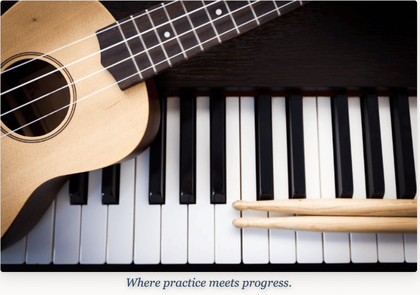

**Where practice meets progress.** 🎵

🎤 **Live demo:** [harmonotesapp.netlify.app](https://harmonotesapp.netlify.app/) — frontend only; see [Installation](#installation) to run the full app with a working backend.

   

         

[](#why-i-built-this) [](#see-it-in-action) [](#features) [](#what-i-learned) [](#installation) [](#whats-next)

</div>


<a id="why-i-built-this"></a>

## 🎼 Why I Built This

> As a lifelong music lover, I've seen firsthand how much of a difference music can make in someone's life, at any age, in any capacity. I wanted to build something that makes it easier to hold onto that.
>
> Whether it's a kid or an adult, the gap between a weekly lesson and real progress is real. One lesson a week just isn't enough, but for most people, it's what they can actually afford. It's so much easier to stick with something when you have a real tool to manage your practice and track your progress.

Just one hour after a lesson, students forget over half of what they learned. Within 24 hours, that number climbs to 70%. ***Harmonotes*** exists to close that gap — one place for students to log practice sessions, complete assigned exercises and earn XP, and browse a filterable library of songs, exercises, and theory guides by instrument.

Built solo, front to back, as a full-stack capstone: React on the front end, Spring Boot on the back, MySQL underneath, with full CRUD across six real database entities.

**Database entities:** `users` · `students` · `practice_sessions` · `practice_exercises` · `library_item` · `contact_messages`


<a id="see-it-in-action"></a>

## 🎹 See It In Action

<p align="center">
<em>Dashboard</em> &nbsp;&nbsp;·&nbsp;&nbsp; <em>Library</em> &nbsp;&nbsp;·&nbsp;&nbsp; <em>Exercises & Theory</em> &nbsp;&nbsp;·&nbsp;&nbsp; <em>About</em> &nbsp;&nbsp;·&nbsp;&nbsp; <em>Musical staff nav</em>
</p>

<table border="0" cellspacing="10" cellpadding="0"><tr><td align="center">
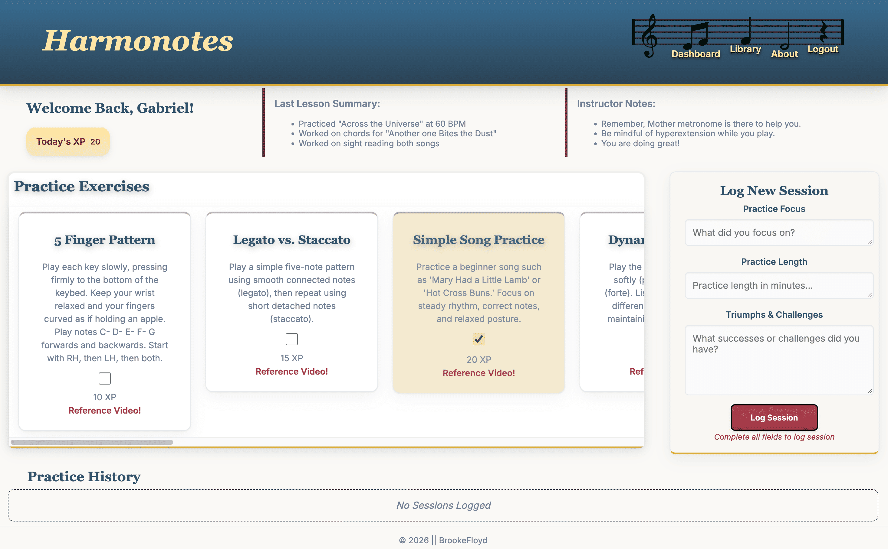&nbsp;&nbsp;
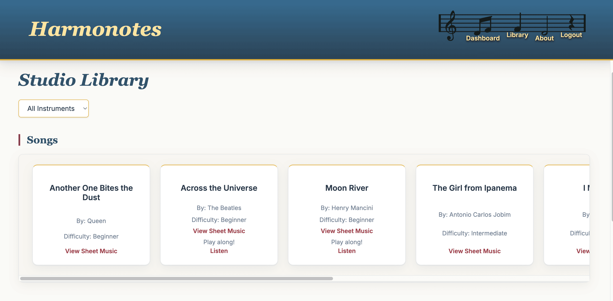&nbsp;&nbsp;
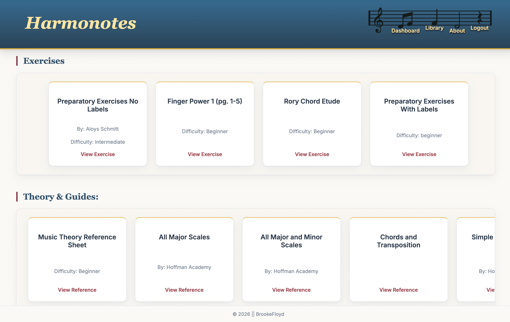&nbsp;&nbsp;
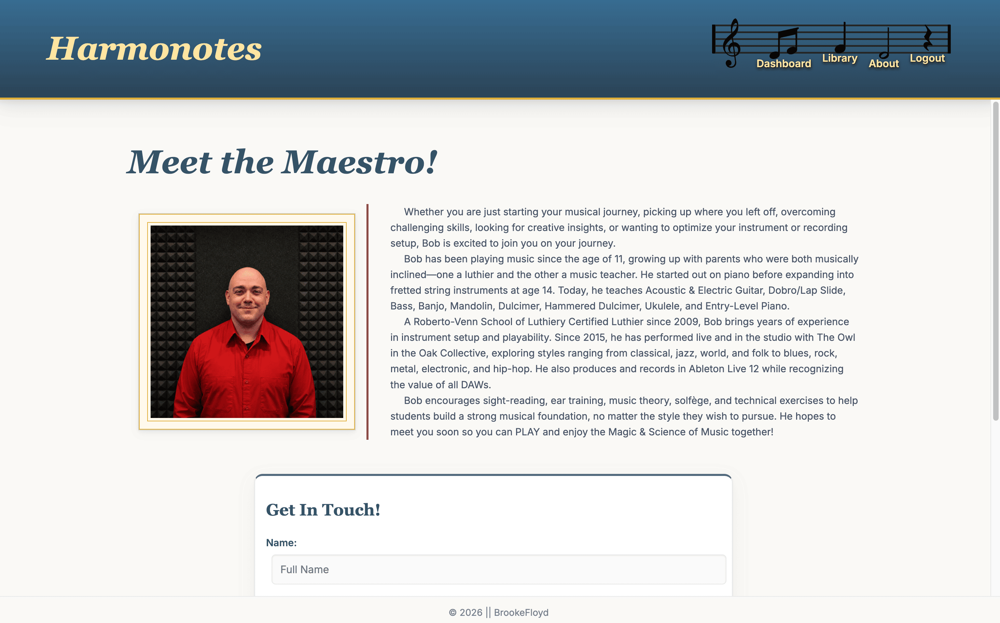&nbsp;&nbsp;

</td></tr></table>

**A closer look at the details 🎶**

<p align="center">
<em>Login validation</em> &nbsp;&nbsp;·&nbsp;&nbsp; <em>Log session</em> &nbsp;&nbsp;·&nbsp;&nbsp; <em>Edit session</em> &nbsp;&nbsp;·&nbsp;&nbsp; <em>Delete confirmation</em> &nbsp;&nbsp;·&nbsp;&nbsp; <em>Contact validation</em> &nbsp;&nbsp;·&nbsp;&nbsp; <em>Contact confirmation</em>
</p>

<table border="0" cellspacing="10" cellpadding="0"><tr><td align="center">
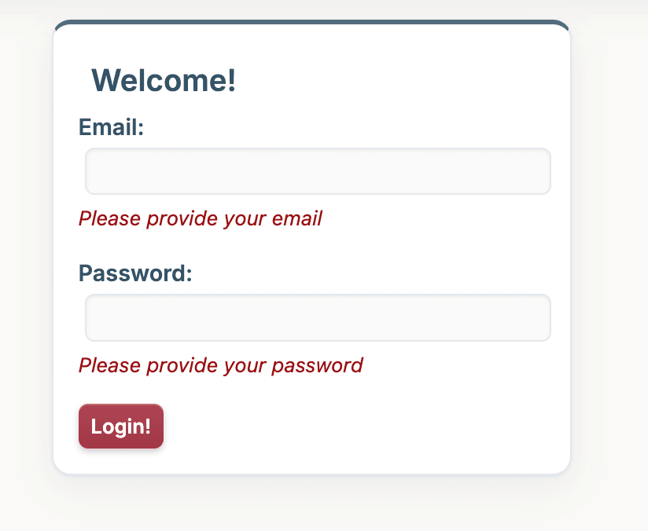&nbsp;&nbsp;
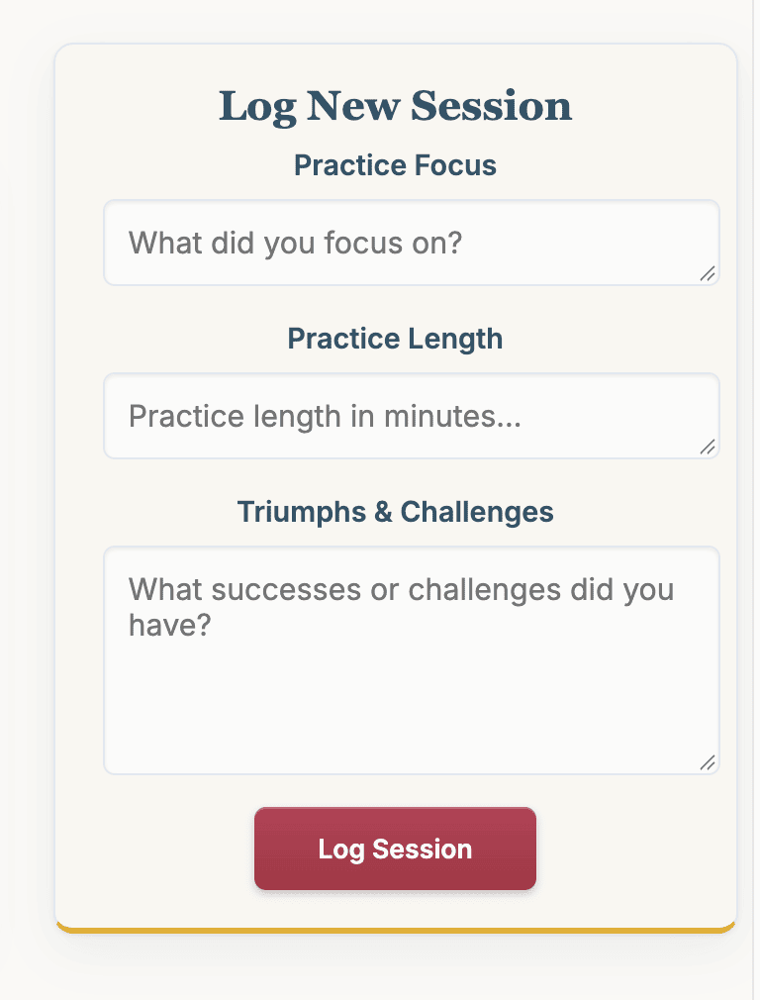&nbsp;&nbsp;
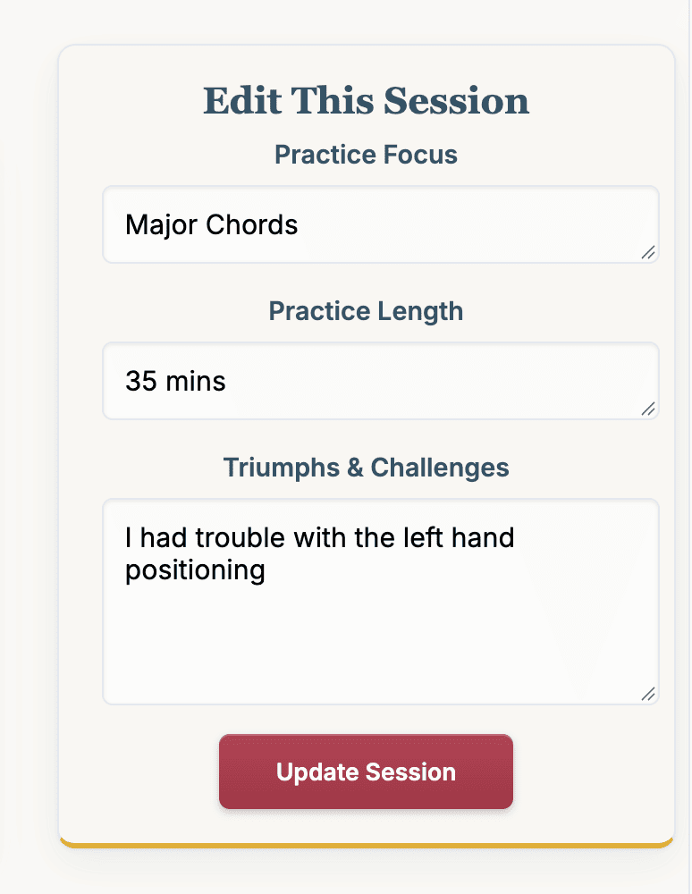&nbsp;&nbsp;
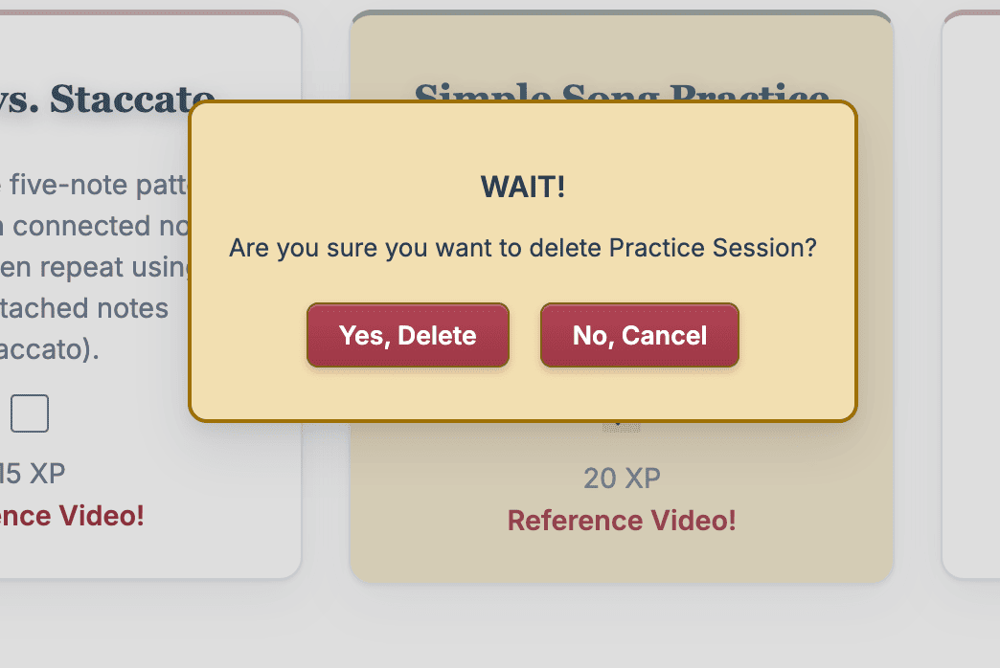&nbsp;&nbsp;
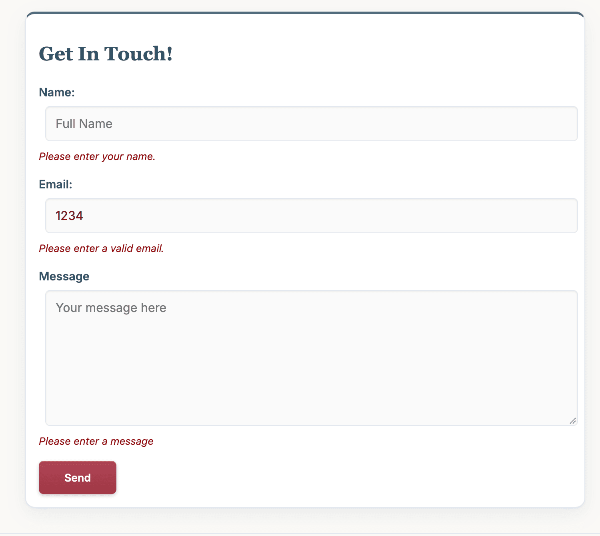&nbsp;&nbsp;
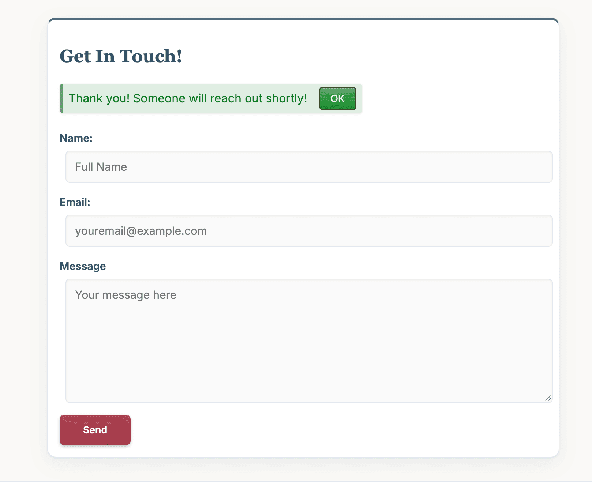
</td></tr></table>


<a id="features"></a>

## 🎧 Features

🎵 Login with real inline validation; the nav bar itself changes based on who's logged in
🎵 A live XP tracker, practice exercises with completion tracking and a confetti celebration on the win
🎵 Full CRUD practice log — log, edit, and delete sessions, each guarded by a hand-built confirmation modal (no browser `alert()`/`confirm()` anywhere in this app)
🎵 Library filtering that hits a real backend query, not a client-side trick, grouped into Songs, Exercises, and Theory & Guides
🎵 A Contact form that actually posts to a real backend entity and validates every field before it does


## 🛠️ Tech Stack

**Frontend:** React 19, Vite, React Router, hand-written CSS — no component library
**Backend:** Java 21, Spring Boot 4, Spring Data JPA / Hibernate
**Database:** MySQL · **Deployment:** Netlify (frontend)

## 🗂️ Project Structure

```
Harmonotes-FullStack-Brooke-F/
├── backend/src/main/java/com/harmonotesapp/backend/
│   ├── config/          # DataInitializer (hardcoded seed data)
│   ├── controllers/     # REST controllers, one per entity
│   ├── dto/             # LoginRequestDTO
│   ├── models/          # JPA entities
│   ├── repositories/    # Spring Data JPA repositories
│   └── services/        # PracticeSessionService
│
└── frontend/src/
    ├── components/
    │   ├── APIs/         # globalGet / globalPost / globalPut / globalDelete
    │   ├── layout/        # Header, NavBar, Footer
    │   ├── practice/       # PracticeCard, PracticeLog, PracticeTable, XPTracker
    │   └── shared/         # Button, DeleteModal, FormField, ContactForm, etc.
    ├── pages/            # Home, Dashboard, Library, About
    └── utils/            # validators.js
```


<a id="what-i-learned"></a>

## 🎓 What I Learned

This was my first time building something this size, end to end, alone — and a lot of it was learned the hard way, mid-build:

- **The Spring Boot bean lifecycle isn't one-size-fits-all.** I started with `@PostConstruct` for seeding data, then learned `CommandLineRunner` runs after the *entire* application context is ready — the safer choice once your seed data depends on the database actually being live.
- **A silently-mismatched setter parameter can break persistence with zero error.** One `this.videoLink = this.videoLink;` typo meant a form field saved as `null` every time, with no exception to point at it — the kind of bug that only shows up when you go looking for it.
- **Closures matter.** Passing a function reference (`onClick={handleDelete}`) vs. calling it immediately (`onClick={handleDelete()}`) is a distinction I now check for by instinct, not by accident.
- **Raster images and CSS color filters don't mix cleanly.** Tracing my own nav icons from raster sprites into real vector paths fixed a rendering bug no amount of CSS tweaking could — sometimes the fix is at the asset level, not the stylesheet.
- **A custom-built confirmation modal is a genuinely small amount of code** — state, a conditional render, a couple of props — once you actually understand what each piece is doing instead of copy-pasting a pattern.


## 🎻 Planning & Design

Wireframes and an ERD were completed before writing a single line of code, including screens scoped for future development.

<p align="center">
<em>Home / Login</em> &nbsp;&nbsp;·&nbsp;&nbsp; <em>Desktop & tablet</em> &nbsp;&nbsp;·&nbsp;&nbsp; <em>Mobile</em> &nbsp;&nbsp;·&nbsp;&nbsp; <em>About</em> &nbsp;&nbsp;·&nbsp;&nbsp; <em>Future: Instructor view</em>
</p>

<table border="0" cellspacing="10" cellpadding="0"><tr><td align="center">
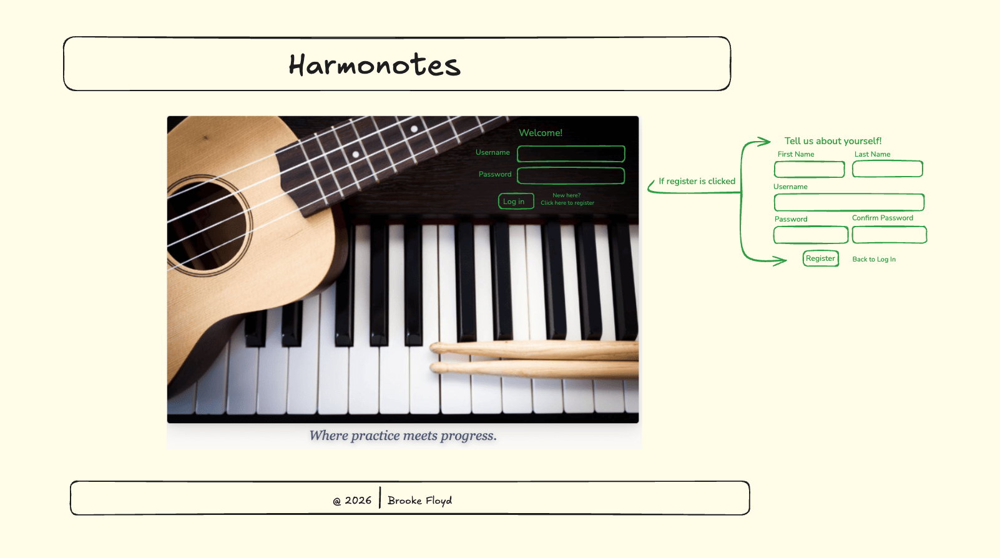&nbsp;&nbsp;
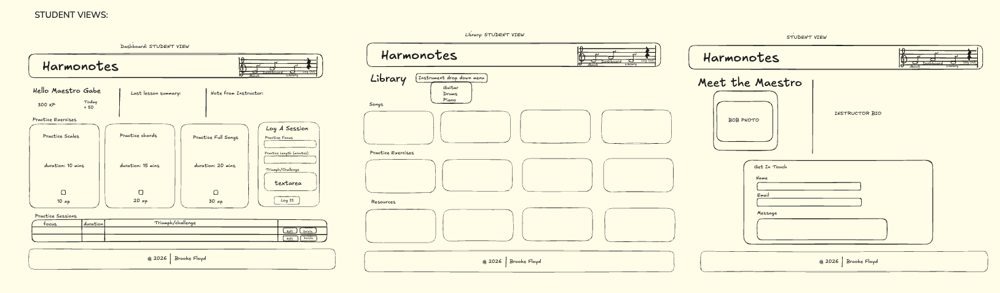&nbsp;&nbsp;
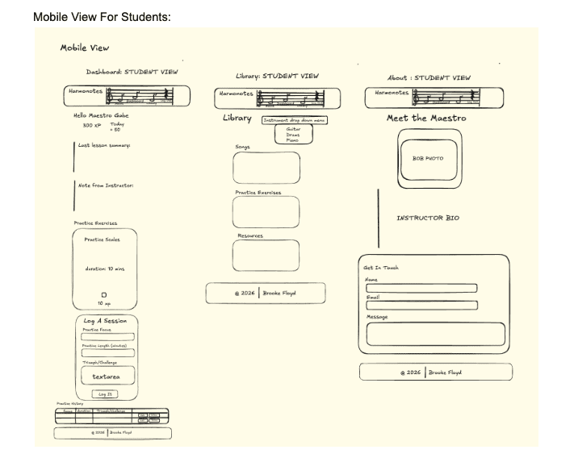&nbsp;&nbsp;
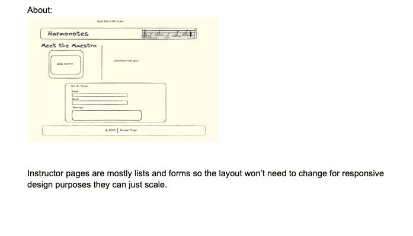&nbsp;&nbsp;
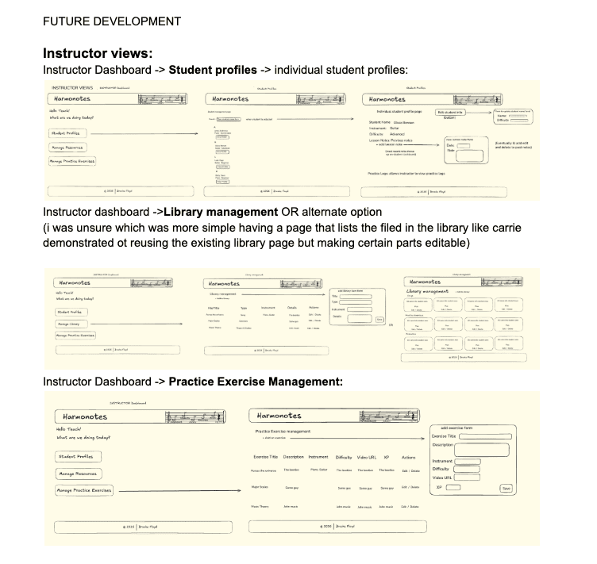
</td></tr></table>

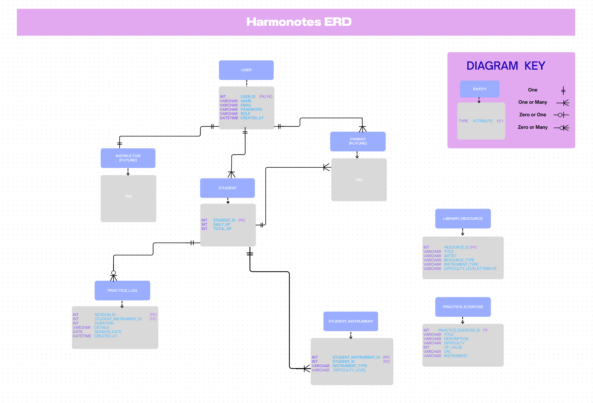
<p align="center"><em>Entity Relationship Diagram — grayed-out tables are scoped for future development.</em></p>

[Full wireframe set](https://excalidraw.com/#json=1teDsRSkcFqFfXRubluT0,oJ2m0l_5cmiyJk7do5sKvw) · [Full ERD](https://docs.google.com/document/d/1IrQWKFfS0T1dQtSAWwm2re9g-4PRUHArJcGMzZ8DLfs/edit?usp=sharing)


<a id="installation"></a>

## 🚀 Installation

**Backend** (`/backend`)
```bash
git clone https://github.com/BrookeFloyd10/Harmonotes-FullStack-Brooke-F.git
cd Harmonotes-FullStack-Brooke-F/backend
```
Create database `harmonotes` in MySQL, then add a `.env` file in `/backend`:
```
DB_USERNAME=your_mysql_username
DB_PASSWORD=your_mysql_password
```
Run:
```bash
./mvnw spring-boot:run
```
API at `http://localhost:8080`. Login uses hardcoded seed credentials (see `DataInitializer`) until real auth is built.

**Frontend** (`/frontend`)
```bash
cd ../frontend
npm install
npm run dev
```
App at `http://localhost:5173`.

## ⚙️ API Reference

| Method | Endpoint | Description |
|---|---|---|
| 📤 POST | `/api/login` | Authenticate with email + password |
| 🔍 GET | `/api/library-items` | All library items, or filter with `?instrument=` |
| 🔍📤🔁🗑️ Full CRUD | `/api/practice-exercises[/{id}]` | Create/edit/delete via Postman only — student UI only toggles completion until the instructor dashboard exists |
| 🔍📤🔁🗑️ Full CRUD | `/api/practice-sessions[/{id}]` | All exposed in the student UI |
| 📤 POST | `/api/contact-messages` | Submit a message from the Contact form |


<a id="whats-next"></a>

## 🎺 What's Next

- 🔐 Real authentication — registration, hashed passwords, Spring Security
- 🎹 Instructor dashboard — student and library management
- 🎸 Multi-instrument support via a dedicated `Instrument` entity
- 👨‍👩‍👧 Interactive parent portal with secure messaging and payment features
- 🎧 In-app audio playback and backend deployment


## Author

**Brooke Floyd** — [GitHub](https://github.com/BrookeFloyd10) · [Repository](https://github.com/BrookeFloyd10/Harmonotes-FullStack-Brooke-F)

*Built by a lifelong music lover who wanted the gap between lesson and practice to be a little smaller.* 🎼
